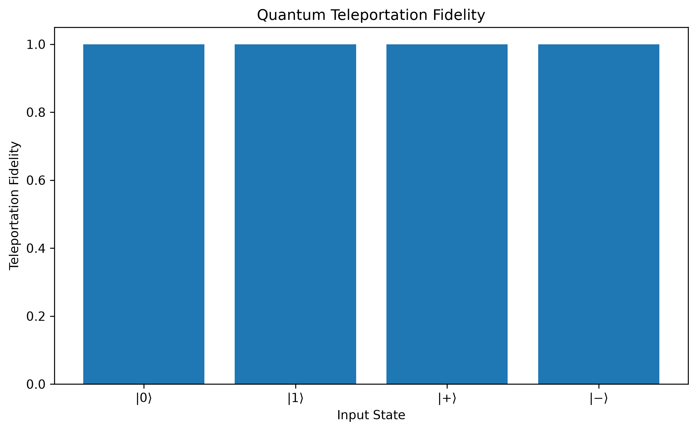

# Quantum Teleportation using Qiskit

A computational implementation and verification of the quantum teleportation protocol using Qiskit.

This project studies quantum teleportation through ideal statevector simulation. The protocol is tested using several single-qubit input states, and the state obtained by the receiver is compared with the original input state using quantum-state fidelity.

The implementation uses a **coherent, measurement-free formulation** of the teleportation circuit for computational verification. This allows the complete quantum state to be inspected directly during simulation.

---

## Overview

Quantum teleportation is a fundamental protocol in quantum information that allows an unknown quantum state to be transferred from one qubit to another using shared entanglement and local quantum operations.

The protocol does **not** physically transmit the original quantum state through the communication channel. Instead, the sender and receiver share an entangled pair, and quantum operations transform the receiver's qubit so that it reproduces the original state.

The standard operational teleportation protocol consists of:

1. Preparing the quantum state to be teleported.
2. Creating an entangled Bell pair shared between sender and receiver.
3. Performing a Bell-basis measurement.
4. Communicating the measurement results classically.
5. Applying conditional corrections at the receiver.

In this project, the measurement and classical feed-forward stages are represented using a **coherent equivalent formulation**. This is useful for statevector-based computational verification because the complete quantum state remains available for analysis.

---

## Physical Setup

The simulation uses three qubits:

| Qubit   | Role                                              |
| ------- | ------------------------------------------------- |
| Qubit 0 | Input qubit containing the state to be teleported |
| Qubit 1 | Sender's half of the shared Bell pair             |
| Qubit 2 | Receiver's half of the shared Bell pair           |

The overall process can be represented conceptually as:

```text
Input state
    │
    ▼
 Qubit 0
    │
    │
    ├───────────────┐
    │               │
    ▼               ▼
Qubit 1 ═════════ Qubit 2
       Bell pair
          │
          │
          ▼
      Receiver
```

Qubits 1 and 2 are first prepared in an entangled Bell state. The input qubit is then combined with the sender's entangled qubit through the teleportation circuit.

---

## Teleportation Protocol

The coherent circuit follows these main stages.

### 1. Prepare the Input State

A single-qubit state is prepared on qubit 0.

The project tests four standard single-qubit states:

| State       | Physical meaning                                 | Category            |
| ----------- | ------------------------------------------------ | ------------------- |
| Zero state  | Computational basis state                        | Basis state         |
| One state   | Computational basis state                        | Basis state         |
| Plus state  | Equal superposition with positive relative phase | Superposition state |
| Minus state | Equal superposition with negative relative phase | Superposition state |

The mathematical definitions of these states are:

$$
|0\rangle
$$

$$
|1\rangle
$$

$$
|+\rangle =
\frac{|0\rangle + |1\rangle}{\sqrt{2}}
$$

$$
|-\rangle =
\frac{|0\rangle - |1\rangle}{\sqrt{2}}
$$

The first two are computational-basis states, while the last two are superposition states. The plus and minus states differ in their relative phase, making them useful for verifying that the teleportation protocol preserves quantum-state information beyond simple basis-state populations.

### 2. Create the Bell Pair

Qubits 1 and 2 are prepared in the Bell state

$$
|\Phi^+\rangle =
\frac{|00\rangle + |11\rangle}{\sqrt{2}}.
$$

This is achieved using a Hadamard gate followed by a controlled-NOT gate:

```text
Qubit 1 ─── H ───●───
                 │
Qubit 2 ─────────X───
```

### 3. Apply the Bell-Basis Transformation

The input qubit and the sender's half of the Bell pair are transformed using controlled-NOT and Hadamard operations.

### 4. Apply Coherent Corrections

The receiver's qubit is corrected using controlled quantum operations.

These operations form a coherent equivalent of the conditional corrections that would normally depend on the classical measurement results in the standard teleportation protocol.

### 5. Analyze the Receiver's State

The final statevector is obtained from the ideal simulation.

Qubits 0 and 1 are then traced out to obtain the receiver's reduced density matrix.

---

## Fidelity Verification

To determine whether teleportation succeeded, the receiver's final state is compared with the original input state.

The project uses quantum-state fidelity:

$$
F(\rho,\sigma)
$$

where $\rho$ represents the original input state and $\sigma$ represents the receiver's final state.

For a pure input state $|\psi\rangle$, the fidelity can be expressed as:

$$
F =
\langle\psi|\rho_{\text{receiver}}|\psi\rangle.
$$

The fidelity satisfies:

$$
0 \leq F \leq 1.
$$

A value of

$$
F = 1
$$

indicates identical quantum states, while lower values indicate increasing disagreement between the original and reconstructed states.

Because this project uses an ideal noiseless simulation, the expected fidelity for the tested states is numerically equal or extremely close to 1, with any tiny deviation attributable to floating-point precision.

---

## Experiments

The notebook evaluates the teleportation protocol for four different input states.

| Experiment | Input state | What is being tested                                   | Expected ideal fidelity |
| ---------: | ----------- | ------------------------------------------------------ | ----------------------: |
|          1 | Zero state  | Teleportation of a computational-basis state           |         Approximately 1 |
|          2 | One state   | Teleportation of the other computational-basis state   |         Approximately 1 |
|          3 | Plus state  | Teleportation of an equal superposition state          |         Approximately 1 |
|          4 | Minus state | Teleportation of a phase-sensitive superposition state |         Approximately 1 |

The corresponding mathematical states are:

| Experiment | Mathematical state |
| ---------: | ------------------ |
|          1 | Zero state         |
|          2 | One state          |
|          3 | Plus state         |
|          4 | Minus state        |

Their mathematical definitions are given above in the **Prepare the Input State** section.

Testing multiple states is useful because successful teleportation should not depend on the particular input state chosen.

---

## Results

The ideal statevector simulation is expected to produce a teleportation fidelity numerically equal or extremely close to:

$$
F = 1.
$$

The notebook calculates the fidelity independently for each tested input state and visualizes the results.



The result demonstrates that, under ideal noiseless simulation conditions, the receiver's reduced state reproduces the original input state.

---

## Mathematical Background

A general single-qubit state can be written as

$$
|\psi\rangle =
\alpha|0\rangle + \beta|1\rangle,
$$

where

$$
|\alpha|^2 + |\beta|^2 = 1.
$$

The purpose of quantum teleportation is to reproduce this state on the receiver's qubit without directly transmitting the physical qubit containing the original state.

The protocol relies on entanglement and quantum correlations rather than transmitting the unknown state itself.

The shared Bell state used in this implementation is:

$$
|\Phi^+\rangle =
\frac{|00\rangle + |11\rangle}{\sqrt{2}}.
$$

The complete teleportation procedure transforms the joint system such that the receiver can recover the original state after the appropriate operations.

---

## Simulation Model

This project intentionally uses an idealized computational model.

### Assumptions

* No gate errors
* No measurement errors
* No decoherence
* No channel loss
* No environmental noise
* Perfect state preparation
* Perfect quantum operations
* Exact statevector simulation apart from numerical floating-point precision

These assumptions make it possible to verify the fundamental teleportation mechanism before introducing realistic imperfections.

---

## Why Statevector Simulation?

Statevector simulation provides direct access to the complete quantum state of the simulated system.

This makes it particularly useful for:

* Inspecting quantum states
* Calculating reduced density matrices
* Verifying entanglement-based protocols
* Computing state fidelity
* Studying ideal quantum circuits before introducing noise

The approach is therefore suitable for this project as a first computational verification of quantum teleportation.

---

## Technologies

* **Python** — programming language
* **Qiskit** — quantum circuit construction and quantum-state analysis
* **NumPy** — numerical computation
* **Matplotlib** — visualization
* **Jupyter Notebook** — interactive experiment environment

---

## Repository Structure

```text
quantum-teleportation/
│
├── README.md
├── quantumteleportation.ipynb
├── requirements.txt
├── LICENSE
│
└── results/
    └── fidelity_comparison.png
```

---

## Installation

Clone the repository:

```bash
git clone https://github.com/YOUR_USERNAME/quantum-teleportation.git
cd quantum-teleportation
```

Create a virtual environment:

```bash
python -m venv .venv
```

On Windows:

```powershell
.venv\Scripts\activate
```

Install the dependencies:

```bash
pip install -r requirements.txt
```

Launch Jupyter:

```bash
jupyter notebook
```

Then open:

```text
quantumteleportation.ipynb
```

---

## Reproducibility

The experiment is designed to be reproducible from the included notebook and dependency list.

The complete workflow consists of:

```text
Prepare input state
        ↓
Create Bell pair
        ↓
Apply teleportation circuit
        ↓
Simulate final state
        ↓
Trace out sender qubits
        ↓
Obtain receiver state
        ↓
Calculate fidelity
        ↓
Compare results
```

---

## Limitations

The current implementation focuses on ideal statevector simulation and therefore does not represent the imperfections of a physical quantum communication system.

In particular, it does not currently model:

* Quantum channel loss
* Gate noise
* Decoherence
* Detector imperfections
* Measurement errors
* Classical communication delays
* Real hardware limitations

The coherent formulation is also intended for computational verification rather than as a direct replacement for the standard operational measurement-based teleportation protocol.

---

## Future Work

Possible extensions include:

### Arbitrary Input States

Extend the experiment beyond the four predefined states and test arbitrary single-qubit states of the form

$$
|\psi\rangle =
\alpha|0\rangle + \beta|1\rangle.
$$

### Noise Modeling

Introduce realistic noise models such as:

* Bit-flip noise
* Phase-flip noise
* Depolarizing noise
* Gate errors

Then investigate how teleportation fidelity changes as the noise strength increases.

### Measurement-Based Teleportation

Implement the standard operational teleportation protocol explicitly using:

* Bell-basis measurements
* Classical bits
* Conditional corrections

This would allow a direct comparison between the operational and coherent formulations.

### Hardware Execution

Run the teleportation circuit on real quantum hardware and compare experimental results with ideal simulation.

### Quantum Networking

Extend the protocol toward multi-node quantum communication scenarios, including:

* Entanglement distribution
* Entanglement swapping
* Quantum network links
* Fidelity degradation across multiple nodes
* Resource and routing considerations

---

## Author

**Boumendjel Manar**

M.Sc. Quantum Computing
Computer Science · Quantum Communication · Quantum Networking

Interested in:

* Quantum Communication
* Quantum Networking
* Quantum Internet
* Quantum Key Distribution
* Quantum Optics
* Photonic Quantum Systems

---

## License

This project is released under the MIT License.
